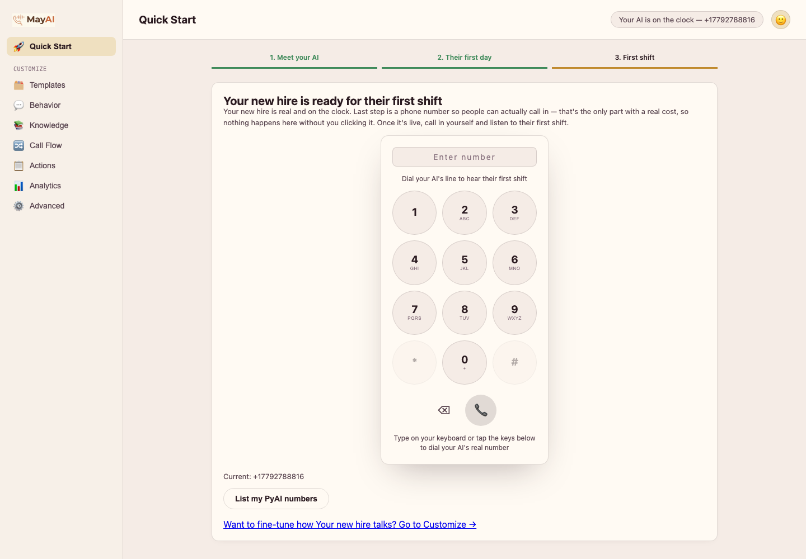

<p align="center">
  
</p>

<h1 align="center">MayAI</h1>

<p align="center">
  <strong>The phone stops ringing out.</strong><br>
  An AI phone receptionist for small businesses that answers from your own documents —
  or says it doesn't know. Free, open source (MIT), built on PyAI Omni.
</p>

---

Tell it what you offer — a PDF, a link you already have, or just typed-in text — and
a real phone number starts answering. It books appointments, answers questions from
what you gave it, flags special requests, and hands off to a human rather than
guessing.

Six industries ship preconfigured: restaurant, real estate, dental, HVAC, legal, and
skincare. Nothing here is a mockup — every screen is wired to PyAI's real Agents,
Knowledgebases, and Tools APIs. Editing a field and saving changes what the live
agent says on the next call.

<p align="center">
  
</p>
<p align="center"><em>Three steps: meet your AI, give it what it needs to know, put it on the phone.</em></p>

<p align="center">
  
</p>
<p align="center"><em>Upload a file, paste a link, or type it in. PyAI parses and indexes all three.</em></p>

## The bet

Everyone can wire an LLM to a phone number now. The part almost nobody bothers with
is **refusing to guess about something a caller is relying on being true** — an
allergy, an insurance plan, a listed price.

A generic voice receptionist will confidently answer "no nuts" when it is actually
unsure. That is not a hypothetical; it is the default failure mode of an ungrounded
model asked a factual question it wants to be helpful about.

So every answer is instrumented to carry its receipt: `log_qa_answer` records a
`grounded` flag and the `source_excerpt` behind each reply into the audit trail.

Two honest caveats, both tracked in [docs/STATUS.md](docs/STATUS.md): the recorded
excerpt is **not yet surfaced anywhere in the UI**, and no live call has yet produced
a grounded answer — so today this is instrumented and designed, not demonstrated.

**Read [docs/ARCHITECTURE.md](docs/ARCHITECTURE.md#the-grounding-gate-described-accurately)
for what actually enforces this.** Omni is a fused speech-to-speech model, so there
is no seam to insert a hard pre-utterance block — this is a soft gate with a real
audit trail, and that distinction is stated plainly rather than oversold.
[docs/STATUS.md](docs/STATUS.md) records how well it is currently evidenced in
practice.

## Pricing model

Outcome-based: the first 30 outcomes each month are free, then a flat per-outcome
price. An "outcome" is precisely one of the four tool actions succeeding — a booking
made, a question answered from your documents, a special request captured, or a call
escalated to a person. The billing unit and the audit trail are the same data.

## Quick start

Requires Node 22+.

```bash
npm install
cp .env.example .env
```

Get a cardless PyAI sandbox key — enough for everything except buying a phone number:

```bash
curl -sX POST https://api.pyai.com/v1/sandbox/keys \
  -H "Content-Type: application/json" \
  -d '{"label":"mayai"}'
```

Put it in `.env` as `PYAI_API_KEY`, then:

```bash
npm run spike   # smoke test: proves a real Omni session + agent config works
npm start       # builder UI + server on http://localhost:8080
```

For a **real ringing phone number** you need a `pyai_live_` key with credit from
[console.pyai.com](https://console.pyai.com), and `PUBLIC_HOST` set to a publicly
reachable host (PyAI validates tool-webhook URLs against an SSRF allow-list, so
localhost won't do — an `ngrok http 8080` hostname works while developing). Buying a
number costs real money; the UI confirms before assigning one.

See [docs/SETUP.md](docs/SETUP.md) for the full path including the Twilio fallback.

## Project structure

```
server.js                  Fastify app entry
src/
  db.js                    SQLite schema — config, calls, bookings, notes, Q&A, tool audit trail
  pyai.js                  Thin REST client over api.pyai.com
  agentSync.js             The only module that pushes local config -> the live PyAI agent
  industries.js            Industry registry — booking/Q&A/note shape per business type
  promptBuilder.js         Assembles the persona system prompt from Behavior + Call Flow
  tools.js                 The four real tools (dynamic per industry) + outcome derivation
  anthropic.js             Minimal Claude Messages API client
  extraction.js            Post-call transcript -> outcomes (see ARCHITECTURE.md)
  callPoller.js            Polls ended calls for their transcript
  routes/
    config.js              Templates / Behavior / Call Flow / Advanced + Quick Start
    knowledge.js           Upload / URL / paste -> PyAI Knowledgebase, bounded retry
    actions.js             Call, booking, Q&A and note log (read side)
    analytics.js           Outcome counts, grounding rate, call volume
    telephony.js           PyAI-native number + Twilio-bridge fallback
    webcall.js             Mints ephemeral browser-to-PyAI session tokens
    webhooks.js            PyAI engine -> our tool webhooks
public/                    Quick Start wizard + 6-tab Customize builder (vanilla JS, no build step)
scripts/                   Manual probe scripts against the live API (not automated tests)
```

No frontend framework and no build step, on purpose — the builder is plain
JS/HTML/CSS.

## Scripts

| Command | What it does |
| --- | --- |
| `npm start` | Run the server + builder UI |
| `npm run dev` | Same, with `--watch` reload |
| `npm run spike` | Smoke test a real agent + real Omni session |

The files in `scripts/` are **manual one-off probes** used to isolate platform
behaviour during the build, not an automated test suite. See
[docs/STATUS.md](docs/STATUS.md).

## Documentation

| Document | Contents |
| --- | --- |
| [docs/ARCHITECTURE.md](docs/ARCHITECTURE.md) | How it fits together, and what actually enforces grounding |
| [docs/PLATFORM-NOTES.md](docs/PLATFORM-NOTES.md) | Real platform behaviour found by running it — several things contradict the docs |
| [docs/STATUS.md](docs/STATUS.md) | Honest current state: what works, what is unproven, what is not built |
| [docs/SETUP.md](docs/SETUP.md) | Full setup including a real phone number and the Twilio fallback |

## Not built, not faked

Outbound calling, payment processing, multi-location support, languages beyond
English and Hindi (Mandarin was cut rather than faked — the platform's agent-level
`language` field didn't support it), anything beyond each industry's defined intents,
and hand-rolled voicemail detection. Details and reasoning in
[docs/STATUS.md](docs/STATUS.md).

## Data handling

Call audio and transcripts are processed by PyAI. Post-call transcripts are sent to
Anthropic's API for outcome extraction when `ANTHROPIC_API_KEY` is set; without it,
calls simply show extraction as skipped. Business configuration and call outcomes are
stored locally in SQLite. Nothing is sent anywhere else.

## License

MIT — see [LICENSE](LICENSE).
